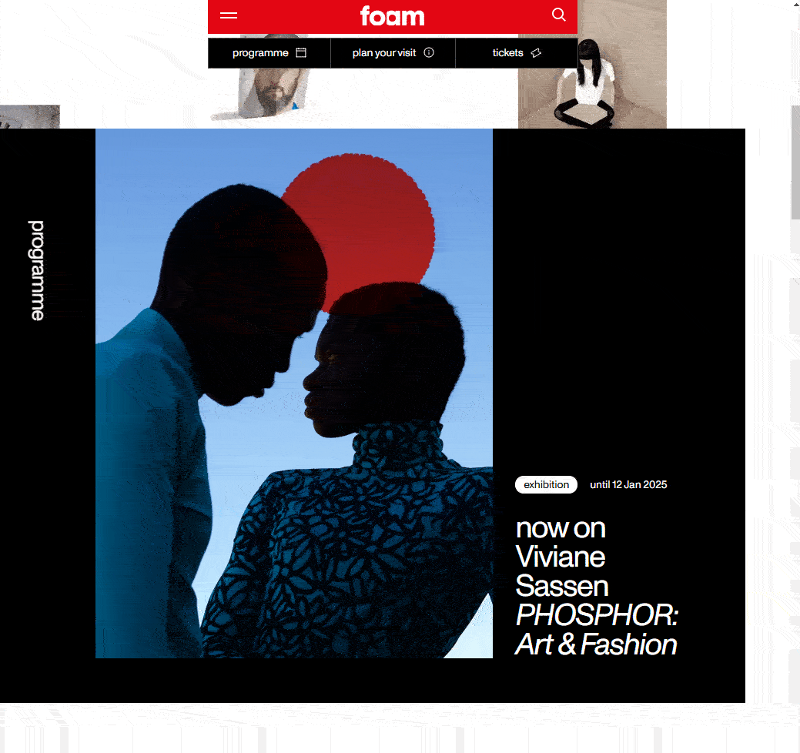

# DAY_024 | Navigation Menu with GSAP Animation

## Project Overview

For **DAY_024** of my daily code challenge series, I developed a **navigation menu** that features a smooth transition effect using **HTML**, **CSS**, **JavaScript**, and **GSAP**. The menu includes a toggle button that triggers a dynamic animation, allowing the navigation items to appear and disappear with sleek transitions. This project highlights the use of a timeline-based animation sequence powered by GSAP.

---

### Inspiration from Awwwards Element by Foam

The contextual menu design is inspired by the award-winning navigation on [Foam](https://www.foam.org/), which won **Site of the Day** on **Awwwards**.

---

## Preview


## Inspiration



---

## Key Features

- **GSAP Timeline Animation**: The navigation toggle triggers a timeline-based animation for smooth transitions, including sliding elements and fading in content.
- **Responsive Navigation Menu**: Built with a focus on flexibility and responsiveness, the navigation menu adapts seamlessly to different screen sizes.
- **Ionicons Integration**: Icons from **Ionicons** are used to enhance the visual appeal of the navigation links and bottom menu.
- **Minimal and Clean Design**: The layout emphasizes a simple, yet modern aesthetic with a focus on whitesmoke and light blue tones.

---

## GSAP in Action

GSAP (GreenSock Animation Platform) is a robust JavaScript library used for creating high-performance animations. In this project, GSAP powers the toggle and reveal animation of the navigation menu. 

### GSAP Timeline Breakdown

```javascript
const tl = gsap.timeline({ reversed: true, paused: true })
  .to(".bottom-nav", { top: "-10%", duration: 0.4, ease: "power2.inOut" })
  .to(".primary-nav", { height: "auto", duration: 0.4, ease: "power3.inOut" }, "-=0.4")
  .from(".nav-links", { autoAlpha: 0, duration: 0.2 }, "-=0.2");
```

1. **Timeline Creation**: 
   - The GSAP timeline controls multiple animations in a sequence. It starts paused and reversed by default, meaning the navigation is initially hidden.
   
2. **Animation of `.bottom-nav`**: 
   - The `.to()` method moves `.bottom-nav` upwards by 10%, creating a smooth sliding effect. This action lasts for 0.4 seconds and uses the `power2.inOut` easing function to ensure smooth acceleration and deceleration.

3. **Primary Navigation Expansion**:
   - The `.primary-nav` element’s height changes to "auto," expanding the space to display the full navigation content. This occurs simultaneously with the first animation (`"-=0.4"`), meaning both start at the same time.

4. **Fading in `.nav-links`**: 
   - The `.from()` method makes the `.nav-links` invisible (opacity 0) at first, then animates them into view with a fade effect over 0.2 seconds. This is slightly delayed to create a staggered visual effect as the menu expands.

### Using GSAP for Smooth User Interaction

GSAP enhances the interaction by providing smooth, controlled animations that respond instantly to the toggle action. The use of timelines allows precise control over animation sequences, making the interface feel dynamic and polished.

---

## How to Run

1. **Clone the repository**:

   ```bash
   git clone https://github.com/thounny/DAY_024.git
   ```

2. **Navigate to the project directory**:

   ```bash
   cd DAY_024
   ```

3. **Open the `index.html` file** in your browser, or use a local development server like **Live Server** in VSCode.

---

## Project Structure

```bash
DAY_024/
|── assets/
|── fonts/
|── styles.css
|── index.html
```

---

## Technologies Used

- **HTML5**: For structure and layout.
- **CSS3**: To handle styling, layout, and animations.
- **JavaScript (ES6)**: For interactive functionality and menu control.
- **GSAP (GreenSock Animation Platform)**: Powers the smooth animations and transitions in the navigation system.
- **Ionicons**: Provides the icons used in the menu items.

---

## Author


**Thounny Keo**  
Creative Developer & Designer  
Frontend Development Student | Year Up United

---


